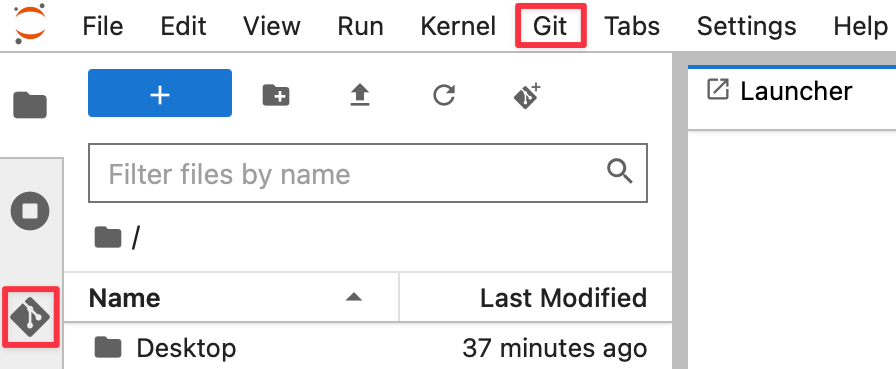

[Git](https://git-scm.com/) is a free-open source, version control system commonly used for managing code and data repositories. This guide shows you how to transfer data from GitHub or GitLab repositories to your SURF Research Cloud workspace.

Utrecht University's RDM support team offers [workshops](https://www.uu.nl/en/research/research-data-management/workshops/introduction-to-github) if you want to learn more about Git and version control. 

### When to Use Git

Git is ideal for:

- **Code repositories**: Scripts, notebooks, and source code
- **Collaborative projects**: Sharing and syncing work with team members

Git is not recommended for research data, although there is nothing wrong with tracking small, non-sensitive data files with Git. 

### Prerequisites

- A [GitHub](https://github.com/) or [GitLab](https://about.gitlab.com/) account with access to the desired repository
- Experience with Command Line Interface (CLI) is helpful. If you're new to using command line, check out this introductory workshop by Utrecht University's Digital Competence Center: [Introduction to Bash](https://utrechtuniversity.github.io/workshop-introduction-to-bash/).

Commands with git are run with the command line. Follow the instructions below to open a terminal in your workspace.

### Open a Terminal

- **Python Workbench/CLI workspaces**: Open a terminal
- **Jupyter Notebook/VRE Lab**: Click `+` in file browser → Select `Terminal`
- **Windows workspaces**: Use PowerShell or Command Prompt
- **Desktop workspaces**: Open the Terminal application

## Quick Start: Clone a Repository

All workspaces come with git pre-installed, so you can start cloning repositories right away. You can check the version of git installed by running:
```bash
git --version
```

### Step 1: Get the Repository URL

**From GitHub:**

1. Go to your repository on GitHub
2. Click the green `Code` button
3. Copy the HTTPS URL (e.g., `https://github.com/username/repository.git`)

**From GitLab:**

1. Go to your repository on GitLab
2. Click the `Clone` button
3. Copy the HTTPS URL

### Step 2: Clone the Repository

In the terminal, first navigate to the folder where you want to put the repository (e.g. inside your [storage volume](../first-steps.qmd#create-storage-volume) and run:
```bash
git clone https://github.com/username/repository.git 
#Replace the URL with your actual repository URL.
```

This creates a folder with all your repository files.


## Updating Your Data

If the repository is updated on GitHub/GitLab, you can pull your changes with the `git pull` command. First make sure you are located in your repository folder:
```bash
git pull
```

## Uploading Changes Back (Requires Personal Access Token)

If you've made changes and want to push them back:
```bash
git add .
git commit -m "Description of changes"
git push
```

::: {.callout-important}
## Authentication for Pushing

If you have two-factor authentication (2FA) enabled on GitHub/GitLab, you'll need to use a **Personal Access Token** instead of your password when pushing.

- **GitHub**: [Create a Personal Access Token](https://docs.github.com/en/authentication/keeping-your-account-and-data-secure/managing-your-personal-access-tokens)
- **GitLab**: [Create a Personal Access Token](https://docs.gitlab.com/ee/user/profile/personal_access_tokens.html)

When prompted for a password, enter your token instead.
:::
::: {.callout-important}
## GitHub repositories within UU GitHub organization

If your repository is part of the [UU GitHub organization](https://github.com/utrechtuniversity), you have to [authorize your personal access token](https://docs.github.com/en/enterprise-cloud@latest/authentication/authenticating-with-single-sign-on/authorizing-a-personal-access-token-for-use-with-single-sign-on).
:::
::: {.callout-important}
**Don't share your Personal Access Token. Treat it like your password**
:::

## Common Git Commands

| Command | Purpose |
|---------|---------|
| `git clone <url>` | Download a repository |
| `git pull` | Get latest changes from remote |
| `git status` | Check what files have changed |
| `git add <file>` | Stage specific file for commit |
| `git add .` | Stage all changes for commit |
| `git commit -m "message"` | Save staged changes with a message |
| `git push` | Upload commits to remote repository |
| `git log` | View commit history |
| `git branch` | List branches |

## Using Git in JupyterLab Interface (GUI Alternative)

Workspaces that support JupyterLab ([Jupyter Notebook](../workspaces/programming/jupyter.qmd), [VRE Lab](../workspaces/programming/vre-lab.qmd)) include a built-in Git extension that provides a graphical interface for Git operations, making it easier for users who prefer not to use the command line.


### Accessing the Git UI

1. In JupyterLab, look for the [Git icon](https://git-scm.com/community/logos) in the left sidebar
2. Click it to open the Git panel.

{width=50%}

3. From here, you can clone repositories, view changes, commit, and push/pull through a visual interface. This provides a user-friendly alternative to command-line Git operations, especially useful for beginners.

If you don't see the Git icon, you can install the extension by running `pip install jupyterlab-git` in a terminal or by downloading the `jupyterlab-git` extension from the JupyterLab Extension Manager.

:::::: {.callout-tip}
# Tutorial for Using GitUI
To see how you can use the Git extension in JupyterLab, check out this tutorial: [Using Git in JupyterLab](https://blog.reviewnb.com/jupyterlab-git-extension/).

You can also create pull requests directly from the JupyterLab Git UI as well. This allows you to contribute to repositories without leaving your JupyterLab environment. To do so, you need the [JupyterLab-Gitplus plugin](https://github.com/ReviewNB/jupyterlab-gitplus). 
Check out this tutorial to learn how to [Create Pull Requests in JupyterLab](https://blog.reviewnb.com/gitplus-jupyterlab-github-extension/). 

You can find the official documentation here: [JupyterLab Git Extension](https://github.com/jupyterlab/jupyterlab-git#jupyterlab-git).
:::

::: {.callout-note}
**Authentication:** The same Personal Access Token requirements apply when pushing through the JupyterLab Git UI.
:::

## Troubleshooting

`git: command not found`

- Git is not installed. 
- Try installing it with: `sudo apt install git`

**Authentication failed**

- Check if your [Personal Access Token](https://docs.github.com/en/authentication/keeping-your-account-and-data-secure/managing-your-personal-access-tokens)
- Ensure you have access to the repository
- If you have 2FA enabled, use a [Personal Access Token](https://docs.github.com/en/authentication/keeping-your-account-and-data-secure/managing-your-personal-access-tokens) instead of your password
- Ensure your Personal access token is [authorized](https://docs.github.com/en/enterprise-cloud@latest/authentication/authenticating-with-single-sign-on/authorizing-a-personal-access-token-for-use-with-single-sign-on) for Single-Sign on, if your repository is under the UU GitHub organization.

**Repository not found**

- Verify the URL is correct (e.g. `https` and **not** `ssh`)
- If the repository is private, ensure you have permission to access it

**Large files cause errors**

- [Remove large files from your commits](https://docs.github.com/en/repositories/working-with-files/managing-large-files/about-large-files-on-github#removing-a-file-added-in-the-most-recent-unpushed-commit)


## Tips

GitHub user documentation can be found here: [GitHub Docs](https://docs.github.com/en/get-started)

Git documentation can be found here: [Git Documentation](https://git-scm.com/)


