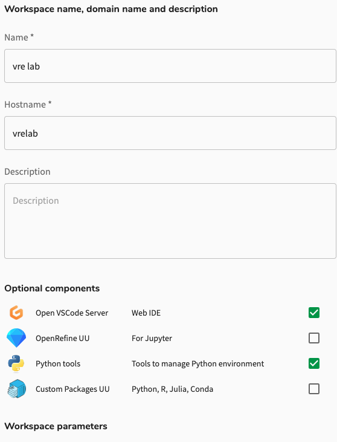
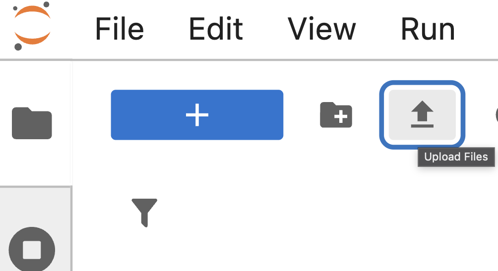

--- 
title: "VRE Lab"
execute:
  echo: false
software:
- Python
- uv
- RStudio 
- OpenVSCode
- OpenRefine
- CUDA (optional)
login:
- webapp-sso
- cli
os_flavor: linux
os:
- Ubuntu 22.04
data:
- ResearchDrive
- irods-icommands
packages: []
gpu: true
admin: true
support: UU
workspace_cuda: VRE lab GPU

---

## Description

This VRE Lab workspace hosts a [JupyterLab](https://jupyterlab.readthedocs.io/en/latest/) environment that provides [Jupyter notebooks](https://jupyter.org/) alongside a number of useful applications accessible through the browser. You can also access RStudio via the browser by selecting it when creating your workspace. This catalog item can easily be extended with additional applications to suit your research needs.

VRE Lab workspace is also available with a **Desktop** interface. Select Ubuntu Desktop as the flavor when [creating your workspace](../../manuals/creating.qmd) and you can access it from the JupyterLab environment. 

The Desktop option is particularly useful for GUI applications, 3D visualization tasks, and when combined with GPU workspaces (**VRE Lab GPU** catalog item), provides GPU-accelerated rendering for 3D analysis and extensive data processing from the desktop environment.

The workspace includes Python environment management with [`uv`](https://docs.astral.sh/uv/).

You can automatically install environments and dependencies for Python, R, Julia, and Conda using the Custom Packages [Optional Component](#optional-components) provided in this workspace.

If you wish to customise this workspace further by installing system packages or need additional help, you can [contact us](../../contact.qmd)



## Creation







### Optional Components

VRE Lab allows you to customise your workspace by selecting additional optional components during workspace creation. This lets you pre-install tools for your research needs.

During workspace creation, you'll see an `Optional components` section where you can check the components you want to install.

**Available components:**

- **[Open VSCode Server](https://code.visualstudio.com/docs/getstarted/getting-started)**: Web-based integrated development environment (IDE) for coding directly in your browser.
- **[OpenRefine](https://openrefine.org/docs) UU**: Data cleaning and transformation tool accessible from JupyterLab.
- **Python tools**: Additional tools for managing Python environments (includes `uv`, `poetry`, and `conda`).
- **Custom Packages UU**: Automatically install dependencies for Python, R, Julia, or Conda projects from Git repositories, Zenodo, Dataverse, or DOI links.
- **RStudioUU**: Access an [RStudio](https://posit.co/products/open-source/rstudio) IDE with a R environment in the same workspace. 

:::{.callout-tip collapse="true"}
## How to Use Custom Packages UU 

:::

Simply check the boxes for the components you need, then continue with workspace creation. You can always install additional software later using sudo rights from the terminal.

## Access

### Accessing the Workspace





## Usage

After logging in, you'll have access to the [JupyterLab](https://jupyterlab.readthedocs.io/en/latest/) interface which includes: 

 - [Jupyter notebooks](https://jupyter.org/) for interactive coding
 - Additional browser-based applications
 - Integrated [terminal](https://jupyterlab.readthedocs.io/en/latest/user/terminal.html#terminals) access
 - Desktop interface (if you selected the Ubuntu Desktop flavor) that opens in a new browser tab



Use this table to find the appropriate data transfer method for your situation:

| Data Source | Recommended Tool | Best For | Skill Level |
|------------|------------------|----------|-------------|
| Your PC/laptop | JupyterLab Upload button | Small files, quick uploads | Beginner (GUI) |
| Yoda/iRODS | [iBridges](../../manuals/ibridges.qmd) | All file sizes, CLI access | Beginner to Intermediate |
| Yoda/iRODS | [iCommands](../../manuals/icommands.qmd) | Large datasets, transfer automation, CLI | Intermediate (CLI) |
| SURFdrive, ResearchDrive| [rclone](../../manuals/rclone-researchcloud.qmd) | Cloud storage sync, scheduled transfers | Intermediate (CLI) |
| Your PC/laptop | [scp](../../manuals/ssh-data-transfer-methods.qmd) | Direct one-time transfers | Intermediate (CLI) |
| Your PC/laptop | [rsync](../../manuals/ssh-data-transfer-methods.qmd) | Sync or repeated transfers | Intermediate (CLI) |
| Your PC/laptop (Windows only) | [MobaXterm](https://mobaxterm.mobatek.net/) | Graphical SSH/SFTP client | Intermediate |
| Your PC/laptop | [Cyberduck](https://servicedesk.surf.nl/wiki/spaces/WIKI/pages/112592488/Upload+data+to+a+workspace+with+Cyberduck)| Graphical SFTP client | Intermediate |
| GitHub/GitLab | [git clone](../../manuals/git-clone.qmd) | Code repositories, version control | Intermediate (CLI) |

You can upload data directly to the workspace using the `Upload Files` button in the JupyterLab interface.

{width=300px}

::: {.callout-tip}
## Transferring from OneDrive
OneDrive is currently not directly supported with rclone for UU accounts. To transfer files from OneDrive:

1. Download (preferably compress/zip) files from OneDrive to your local PC
2. Transfer from your PC to the workspace using one of the methods above
:::

For larger data transfers, the recommended [iBridges client for Yoda and iRODS](../../manuals/ibridges.qmd) is preinstalled.



## Tips

This workspace includes `uv` for Python environment management. See the [Python environment manual](../../manuals/python-environment.qmd) for best practices and getting started.


