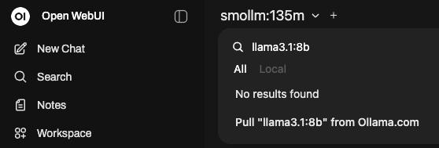

--- 
title: "Ollama Open WebUI"
software:
- '[Open WebUI](https://docs.openwebui.com/)'
- '[Ollama](https://ollama.com/)'
login:
- webapp-sso
os_flavor: linux
os:
- Ubuntu 22.04
- Ubuntu 24.04
packages:
- CUDA (optional)
gpu: true
admin: false
support: UU
---

## Description

[Open WebUI](https://docs.openwebui.com/) is a user-friendly and privacy-friendly AI platform that allows you to interact with AI models locally on your workspace. This workspace is configured to use [Ollama](https://ollama.com/) models that are downloaded directly to the workspace. You can also use models from [HuggingFace](https://huggingface.co/models). 

Ollama Open WebUI gives you **complete privacy** as all processing happens on your workspace, no information is sent to external AI services.

For security reasons, the Open WebUI API is disabled by default.

## Creation

::: {.callout-important}
## Planning Your Workspace

Before creating your workspace, consider:

1. **Which model do you want to use?** (See recommendations below)
2. **How much storage do you need?** Models can be very large (1GB - 40GB+)
3. **Do you need GPU acceleration?** Required for large models (>8B parameters)

**If you plan to download large models, create and attach a storage volume first.** 

See the [Getting started](../../first-steps.qmd#create-storage-volume) page for more info about how and why to create a storage volume.
:::

Remember that you are responsible for making backups of any data yourself! Although data on a storage unit will not be deleted when you delete the workspace, it can still become corrupt. So if it is important to your work, make sure to make periodical (e.g. daily or weekly) backups of your projects.

### Recommended Models and Resources

Here are some popular Ollama models with their resource requirements:

| Model | Size | CPU/GPU | Best For |
|-------|------|---------|----------|
| `llama3.2:1b` | ~1 GB |  CPU | Testing, simple tasks, very fast responses |
| `llama3.2` | ~2 GB |  CPU | General chat, quick responses |
| `mistral` | ~4 GB | CPU/ GPU | Balanced speed and quality |
| `llama3.1:8b` | ~5 GB | GPU recommended | High-quality responses, coding |
| `llama3.1:70b` | ~40 GB |  GPU required | Best quality, complex reasoning |

Find all available Ollama models here: [List of Ollama models](https://ollama.com/library)

### Workspace Size Selection

When creating your workspace, you'll need to select a processor configuration:

**Since Ollama is resource-intensive, we recommend:**

- **For small models (1B-8B):** 2-8 CPU cores or higher
- **For large models (13B+):** GPU workspaces 

Although larger models and GPUs are avaiable, you should not simply select the most hardware available (see [responsible use](../../responsible-use.qmd)).
If you are unsure, please [contact us](../../contact.qmd).

::: {.callout-warning}
## Important: CUDA Component for GPU

If you select a workspace with a GPU, select the **CUDA box** under Optional Components in the next step during workspace creation. Without CUDA, the GPU will not be available to the workspace.
:::



## Access

This workspace can be accessed via the yellow 'Access' button, or by opening the URL listed in the dashboard in your browser. Any member of the collaboration can login to the workspace [using Single-Sign On](../../first-steps.qmd#webapplications-that-support-single-sign-on.).

## Usage

### Pulling Models from Ollama

When you access the workspace for the first time, a default model `smollm:135m` is already loaded. However, you may want to download and use other models. 
See [Ollama models](https://ollama.com/library) for a complete list of models. 

To use a different model, simply copy the name of the desired model and select the model dropdown in the top left. From there, you can search for the required model and pull it. 
Pulling a model may take some time depending on the size of the model. Once finished, you can use the pulled model on your workspace. 

::: {.callout-note}
Model downloads are stored on your workspace. If you attached a storage volume, they'll be preserved even if you delete and recreate the workspace.

**NOTE: Cloud-only models CANNOT be pulled**.
:::

### Getting Started

Once you have pulled a model, you can begin using the features available such as **Chatting with models** or **Uploading documents** to analyze files.

For detailed guides on using Open WebUI's features, see the [Open WebUI documentation](https://docs.openwebui.com/) and [Ollama documentation](https://github.com/ollama/ollama/tree/main/docs).

::: {.callout-tip}
If you have pulled several models but are not using them anymore, then remove them. Go to Settings → Admin Settings in the bottom → Models, and then disable the models you no longer use.

Keep your storage volume in mind as large models and tasks can take up a lot of space. 

Keep the costs of running the workspace in mind as well, and pause the workspace when not using it. Refer to the [cost calculator](../../responsible-use.qmd#cost-calculator) for an estimate of the costs.
:::

Review [Utrecht University's AI policy and guidelines here](https://www.uu.nl/en/organisation/ai-policy).
